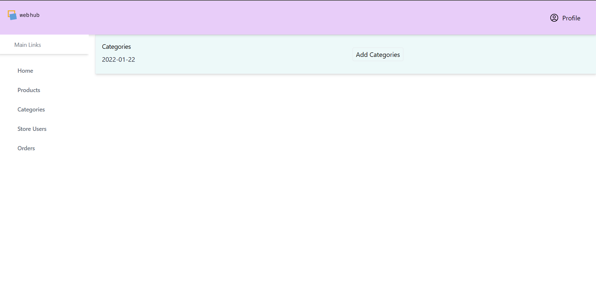

# WebHub

WebHub is a comprehensive e-commerce platform builder that enables users to start, grow, and manage their online business without any coding knowledge. It provides a user-friendly interface for creating and managing online stores, complete with analytics, payment processing, and shipping management capabilities.

## Overview

WebHub aims to remove technical barriers for small businesses and creative entrepreneurs who want to establish their online presence. The platform provides:

- Easy website creation with drag-and-drop functionality
- E-commerce capabilities
- Store analytics dashboard
- Payment processing integration
- Shipping management
- SEO optimization
- Marketing tools

## Features

- **No-Code Website Builder**: Create professional websites without any technical knowledge
- **E-commerce Tools**: Manage products, inventory, and orders
- **Analytics Dashboard**: Track store performance and customer behavior
- **SEO Optimization**: Built-in tools for better search engine visibility
- **Responsive Design**: Websites work seamlessly across all devices
- **Custom Domain Support**: Use your own domain name
- **Secure Transactions**: Protected payment processing

## Technology Stack

### Frontend
- Next.js
- React.js
- CSS
- Figma (for design)

### Backend
- Express.js
- Node.js
- MongoDB
- Mongoose

## System Requirements

### Hardware Requirements
- RAM: 8 GB minimum
- Processor: Intel Core i5 8th gen or higher
- Operating System: Windows, Linux, or macOS

### Software Requirements
- Visual Studio Code
- Node.js
- NPM packages
- MongoDB

## Installation & Setup

1. Clone the repository:
```bash
git clone  https://github.com/sachinchkd/WebHub-Websiter
```

2. Install dependencies:
```bash
cd webhub
npm install
```

3. Set up environment variables:
```bash
cp .env.example .env
```
Edit the .env file with your configuration

4. Run the development server:
```bash
npm run dev
```

## Screenshots





## Project Status

This project was developed as part of the COMP 207 course at Kathmandu University, Department of Computer Science and Engineering.

## License

This project is licensed under the MIT License - see the [LICENSE](LICENSE) file for details.


## Acknowledgments

- Department of Computer Science and Engineering, Kathmandu University
